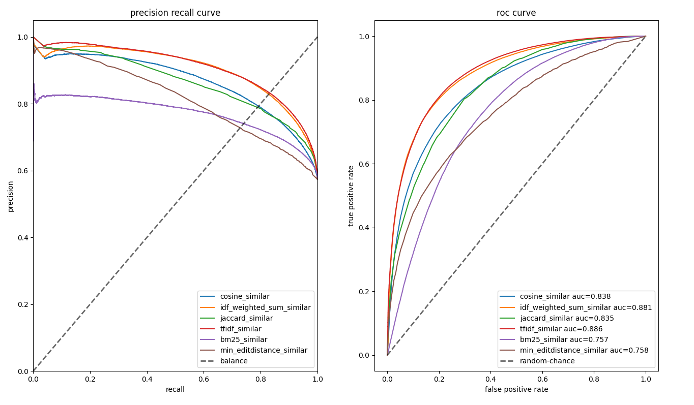
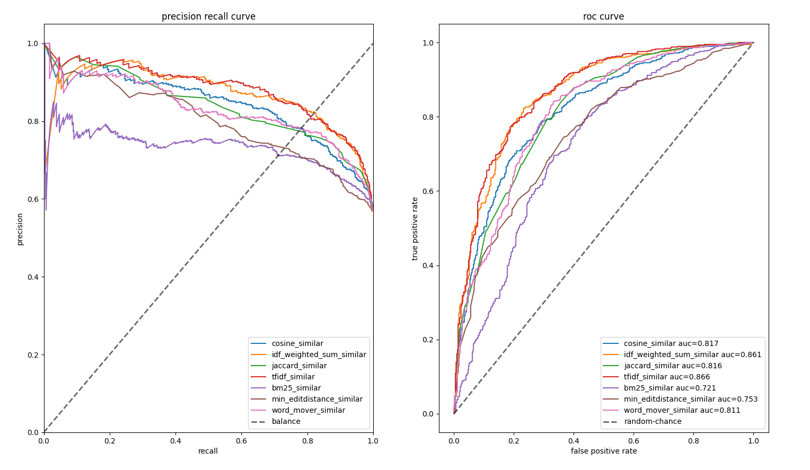
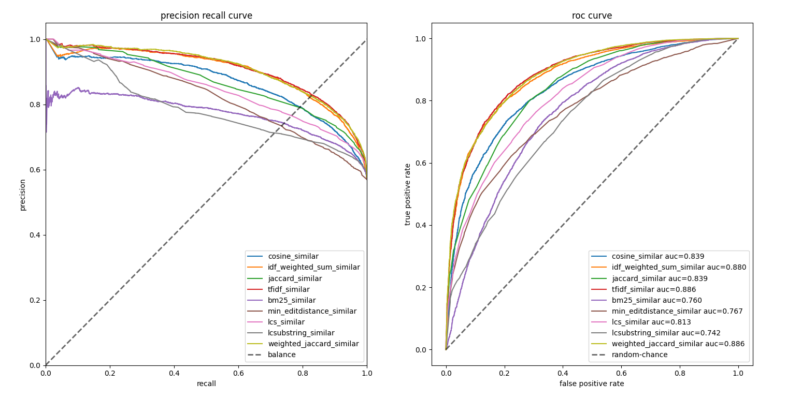

# text-similarity-classical-methods

从表征的角度看，文本匹配方法可以分为三类：

- 基于文本字符的直接匹配
- 基于词向量序列的匹配
- 基于词向量序列所构造的句向量的匹配

于是文本匹配衍生很多经典的方法：
- cosine_similar
- idf_weighted_sum_similar
- jaccard_similar
- weights_jaccard_similar
- bm25_similar
- tfidf_similar
- min_editdistance_similar
- word_mover_similar
- lcs_similar
- longest_common_substring_similar
- cqr_ctr_similar

等等，详细可参看源码。这里对比一下它们的差异。需要注意，选择的词向量、分词算法（工具）需要和数据集匹配，才能有较好的效果。详见见[文章](https://allenwind.github.io/blog/11001/)。

在LCQMC数据集上的PR曲线和ROC曲线（测试1）：

在LCQMC数据集上的PR曲线和ROC曲线（测试2）：

在LCQMC数据集上的PR曲线和ROC曲线（测试3）：

由于wasserstein distance计算太慢了，以下对比只用了1000个样本：

可以说，这些经典的方法还是有不错的效果。

事实上，我们还可以在这些算法基础上进行组合和衍生，比如，jaccard_similar，我们结合IDF对词汇进行加权求和，称为`weighted_jaccard_similar`，效果如下（测试4）：

可以看到，即便没有词向量的参与，效果还是非常好的。
