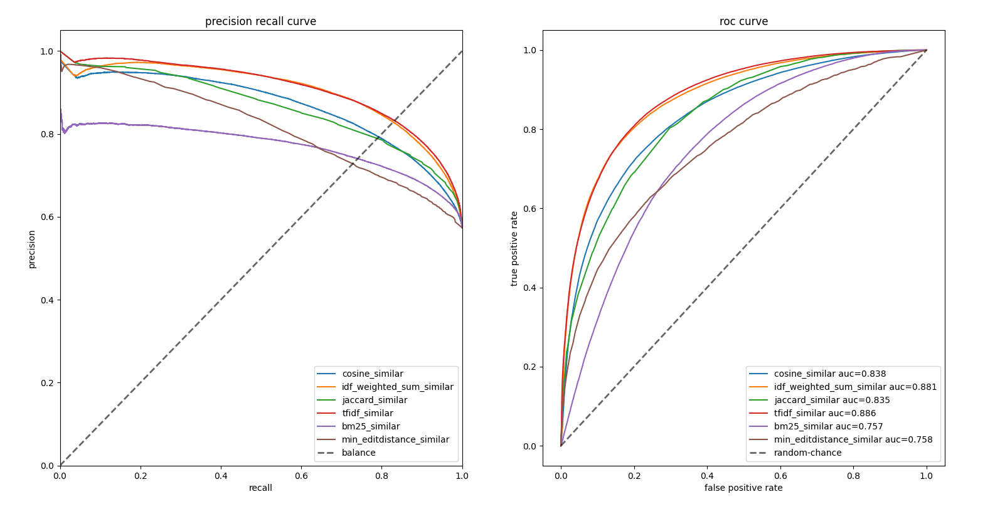
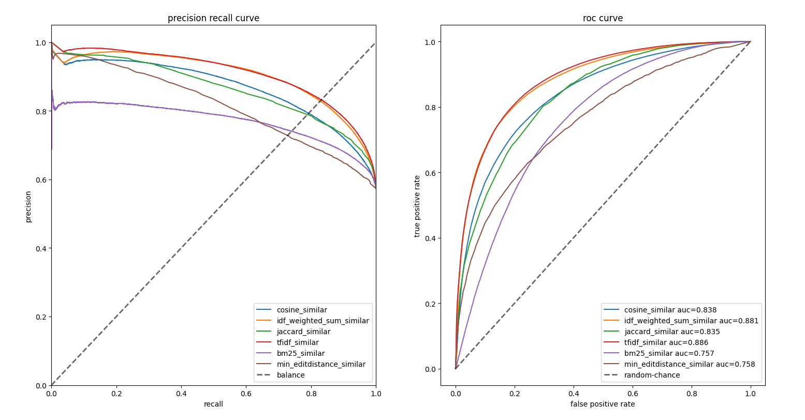

# text-similarity-classical-methods

文本匹配中有很多经典的方法：cosine_similar、idf_weighted_sum_similar、jaccard_similar、bm25_similar、tfidf_similar、min_editdistance_similar、word_mover_similar等等，详细可参看源码。

这里对比一下它们的差异。

在LCQMC数据集上的PC曲线和ROC曲线（1）：

在LCQMC数据集上的PC曲线和ROC曲线（2）：

由于wasserstein distance计算太慢了，以下对比只用了1000个样本：

可以说，这些经典的方法还是有不错的效果。
